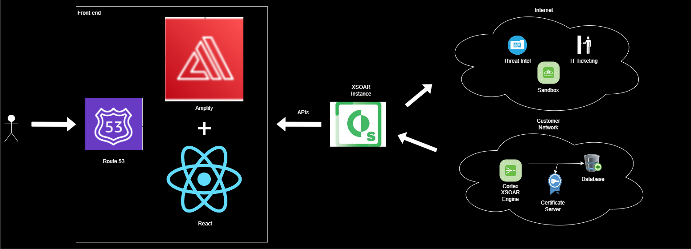

# Palto Alto XSOAR

Palo Alto Networks Cortex XSOAR is a comprehensive Security Orchestration, Automation, and Response (SOAR) platform. It is designed to streamline and automate security operations by integrating various security tools and orchestrating incident response processes.

## Key Features 

1. Automation: Cortex XSOAR allows security teams to automate repetitive tasks and workflows. This can significantly reduce response times to security incidents and enhance overall operational efficiency.

2. Orchestration: The platform enables the coordination and execution of complex workflows involving different security tools and technologies. This helps organizations create a unified and efficient incident response process.

3. Incident Management: Cortex XSOAR provides a centralized platform for managing and responding to security incidents. It allows teams to collaborate, track, and document their response efforts in a structured manner.

4. Integration: The platform supports integration with a wide range of security products and third-party tools. This flexibility enables organizations to connect their existing security infrastructure and create a more cohesive and effective security ecosystem.

5. Threat Intelligence: Cortex XSOAR incorporates threat intelligence feeds, enabling security teams to stay informed about the latest threats and vulnerabilities. This information can be used to enhance incident detection and response capabilities.

6. Playbooks: Playbooks in Cortex XSOAR are predefined and customizable sets of actions that can be executed in response to specific security incidents. These playbooks help automate incident response processes based on best practices and organizational requirements.

7. Analytics and Reporting: The platform provides analytics and reporting features, allowing security teams to gain insights into their incident response performance, identify areas for improvement, and generate reports for compliance or management purposes.

8. War room: Enables security analysts to work together on the same platform (Chat room) at the same time, like analysing certain incident, or ip address

## APIs

These APIs allow users to interact with the cortex XSOAR server, to read data, update data etc using REST.

[Here](./Files/Palto%20Alto%20APIs.csv) in this CSV file, are the APIs of the XSOAR server we can interact with.

## Proposed Architecture

Cortex XSOAR currently utilizes Amazon Web Services (AWS) for the hosted service. Each customer has a dedicated instance on which workloads run on dedicated resources (compute, storage, network) according to advanced security standards (SOC2, ISO 27001).

You can designate a Cortex XSOAR region for the storage and processing of your data. Available AWS regions are: AWS-California, AWS-Oregon, AWS-Virginia, AWS-Ohio, AWS-Frankfurt, AWS-London, AWS-Sydney, AWS-Mumbai, AWS-Singapore, AWS-Tokyo, and AWS-Canada. Additional regions may be added in the future. 

The overview of the full architecture will look like this.

## XSOAR 8 vs XSOAR 6
- Rearchitectured XSOAR 8 with improved features
- [Here](https://docs-cortex.paloaltonetworks.com/r/Cortex-XSOAR/8/Cortex-XSOAR-8-Feature-Changes) for feature changes on XSOAR 8 compared to XSOAR 6
- API Changes

| Feature | Comments |
|---| -------|
|API Key  |Standard and Advanced keys: You can create Standard or Advanced Keys (default is Advanced).Standard keys can be used via CURL, and still require the key in the authorization header, but also require an additional header (x-xdr-auth-id) with the value of the key ID, if using a Standard key.Advanced keys require a nonce to prevent replay attacks which is sent in headers. |
|API Structure | The API is now like Cortex XDR, where the API is not the server URL, but rather: api-{tenant}/public_api/v1/{name of api}/{name of call}.Example of an old API Call with server URL: curl 'https://hostname:443/incidents/search' Example of a new API Call with API URL: curl -X POST https://api-{fqdn}/xsoar/{name of api}/{name of call}/|

### References:
- https://wix.com/encyclopedia/definition/hosted-services
- https://xsoar.pan.dev/docs/reference/api/common-server-python
- https://cortex.marketplace.pan.dev/marketplace/details/DemistoRESTAPI/
- https://xsoar.pan.dev/docs/reference/api/demisto-class
- https://docs-cortex.paloaltonetworks.com/r/Cortex-XSOAR-6-API/
- https://youtu.be/A6CBfUB4JH4?feature=shared
- https://cortex-panw.stoplight.io/docs/cortex-xsoar-8/kjn2q21a7yrbm-get-started-with-cortex-xsoar-8-ap-is
- https://docs-cortex.paloaltonetworks.com/r/Cortex-XSOAR/6.11/Cortex-XSOAR-Hosted-Service-Guide/Cortex-XSOAR-and-AWS-Cloud
- https://xsoar.pan.dev/docs/reference/articles/aws-integrations---authentication
- https://youtu.be/DYJX9KFnJNo?feature=shared
