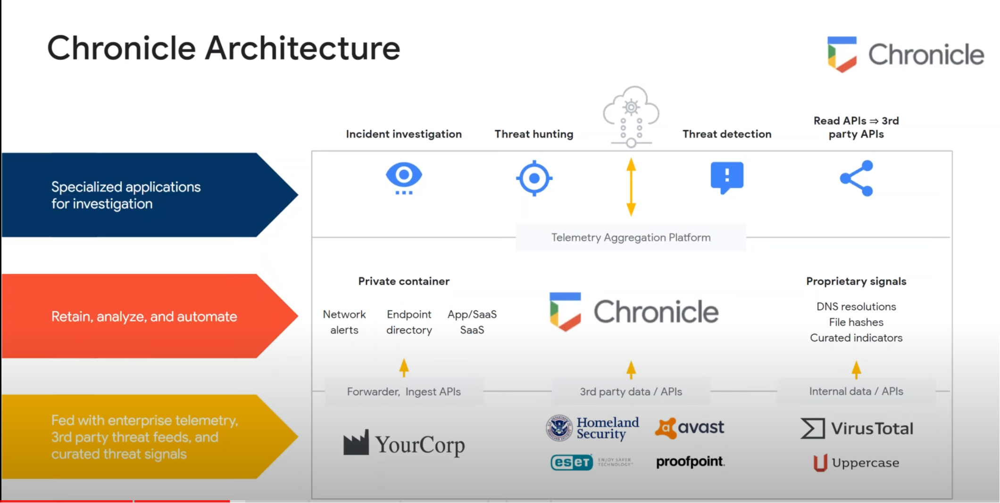

# Google Chronicle

Chronicle Security Orchestration, Automation and Response (SOAR) is a platform designed to help organizations detect, investigate, and respond to security threats in real-time. The platform is powered by Google Cloud's infrastructure and leverages the machine learning capabilities of Google to automate and streamline security workflows.

Chronicle SOAR collects data from various security sources such as network devices, endpoint agents, and threat intelligence feeds. The platform uses this data to identify potential security incidents and initiate response actions. Chronicle SOAR also integrates with other security tools such as SIEM (Security Information and Event Management), threat intelligence platforms, and vulnerability scanners to provide a comprehensive security solution.

The platform provides an intuitive user interface that allows security analysts to investigate incidents, create workflows, and automate response actions without requiring extensive coding knowledge. Chronicle SOAR also uses machine learning to improve its accuracy and speed in identifying and responding to security incidents. The platform's automated response capabilities help organizations to reduce the time taken to detect and respond to security threats, thereby reducing the risk of data breaches and other security incidents.

Chronicle SOAR is a powerful security orchestration, automation, and response platform that helps organizations to enhance their security posture by automating security workflows, reducing response times, and improving the accuracy of security operations

## CSV for APIs

[Here](./Files/GoogleChronicleAPIs.xlsm) for the CSV of google chronicle APIs

### References
- https://cloud.google.com/chronicle/docs/soar/marketplace-integrations
- https://chronicle.security/suite/soar/?gad_source=1&gclid=CjwKCAiA1-6sBhAoEiwArqlGPq6qhWgPEGVW33ZoHmiV48s5kN7vieOqzoD0vm5c3muR7cSd18zwzRoCTBoQAvD_BwE#resources
- https://japac-ce-demo.siemplify-soar.com/swagger/index.html
- https://cloud.google.com/chronicle/docs/soar/reference/working-with-chronicle-soar-apis
- https://chronicle.security/solutions/service-providers/

